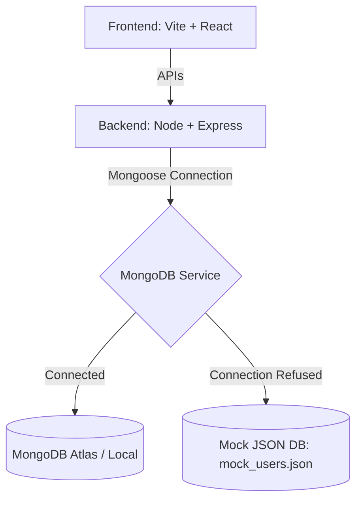

# SkillBridge AI 🚀
### Personalized Learning Path Generator (Problem Statement: PS-02)

SkillBridge AI is a comprehensive career acceleration platform designed to bridge the gap between academic learning and industry readiness. By combining automated resume parsing, personalized learning style quizzes, and dynamic curriculum generation, SkillBridge AI creates curated, interactive, and structured learning pathways tailored to each user.

---

## 📋 Table of Contents
1. [Problem Statement](#-problem-statement)
2. [Proposed Solution](#-proposed-solution)
3. [Key Features](#-key-features)
4. [Technology Stack](#-technology-stack)
5. [Project Architecture](#-project-architecture)
6. [Setup & Installation Instructions](#-setup--installation-instructions)
7. [Developer & Contact Details](#-developer--contact-details)

---

## 🎯 Problem Statement (PS-02)
Students and entry-level job seekers often struggle to identify and fill their technical skill gaps.
* **Lack of personalization:** Static tutorials don't adapt to individual learning styles (visual learners, readers, builders).
* **Information overload:** Endless resources online lead to choice paralysis.
* **Disconnect from recruitment:** Hard to map completed study modules directly to readiness scores that recruiters value.

---

## 💡 Proposed Solution
SkillBridge AI resolves these challenges through an end-to-end adaptive roadmap pipeline:
1. **Analyze Gaps:** Parse resumes to check current skillsets against target role descriptions.
2. **Determine Preference:** Assess study modalities (visual, textual, hands-on) and weekly hours via an onboarding questionnaire.
3. **Adaptive Roadmap**: Generate custom timelines with resource URLs mapped to the selected learning style.
4. **Mock Practice**: Test acquired skills with interactive, role-specific AI mock interviews.

---

## ✨ Key Features
* **Skill Gap Analyzer (Resume Scan):** Upload a resume to scan for missing skills. Instantly highlights mismatches and prompts roadmap generation.
* **Personalized Onboarding Quiz:** Interactive selectors for target tech roles, study preferences (Visual, Textual, Hands-on Builder), and weekly availability sliders.
* **Interactive Visual Roadmap:** Vertical tree timeline of skills. Expand nodes to view curated video tutorials, official documentations, and GitHub project challenges matching your style.
* **Live Progress Tracker:** Verify learning nodes to update your Career Readiness Score and track progress.
* **Interactive Interview Coach:** Generate role-specific interview questionnaires, practice replies, and view detailed scores.
* **Robust Offline Fallback:** Fully operational local environment using a file-based mock database fallback (`backend/data/mock_users.json`) if MongoDB is offline or whitelists are restricted.

---

## 🛠️ Technology Stack
* **Frontend:** React.js, Vite, Vanilla CSS (Premium & fully responsive styling), Stroke-based SVGs.
* **Backend:** Node.js, Express.js.
* **Database & ORM:** MongoDB, Mongoose.
* **Local Fallback:** Custom Mock Mongoose Proxy with local JSON file persistence.
* **Auth:** JSON Web Tokens (JWT) & bcryptjs password encryption.

---

## 🏗️ Project Architecture


---

## ⚙️ Setup & Installation Instructions

### Prerequisites
* [Node.js](https://nodejs.org/) (v16 or higher)
* npm (Node Package Manager)

### Step 1: Clone the Repository
```bash
git clone https://github.com/vaishh002/SkillBridgeAI.git
cd SkillBridgeAI
```

### Step 2: Backend Setup
1. Navigate to the backend directory:
   ```bash
   cd backend
   ```
2. Install dependencies:
   ```bash
   npm install
   ```
3. Create a `.env` file in the `backend/` folder and add your environment variables:
   ```env
   PORT=5000
   MONGO_URI=mongodb+srv://<username>:<password>@cluster.mongodb.net/skillbridge
   JWT_SECRET=supersecrettoken999
   JWT_EXPIRES_IN=7d
   ```
   *Note: If no database is reachable, the server will log a warning and start automatically in **Offline Mock DB mode** using `backend/data/mock_users.json`.*
4. Start the backend server:
   ```bash
   npm run dev
   ```

### Step 3: Frontend Setup
1. Open a new terminal window and navigate to the frontend directory:
   ```bash
   cd ../frontend
   ```
2. Install dependencies:
   ```bash
   npm install
   ```
3. Start the frontend development server:
   ```bash
   npm run dev
   ```
4. Open your browser and navigate to the address shown (usually `http://localhost:5174` or `http://localhost:5173`).

---

## 👥 Developer & Contact Details
* **Developer:** Vaishnavi Shinde
* **Project Role:** Solo Full-Stack Developer (Frontend & Backend)
* **GitHub Profile:** [vaishh002](https://github.com/vaishh002)
* **GitHub Repository:** [SkillBridgeAI](https://github.com/vaishh002/SkillBridgeAI.git)
* **LinkedIn:** [Vaishnavi Shinde](https://www.linkedin.com/in/vaishnavi-shinde02/) 
* **Email:** [shindevaishnavi022003@gmail.com]

